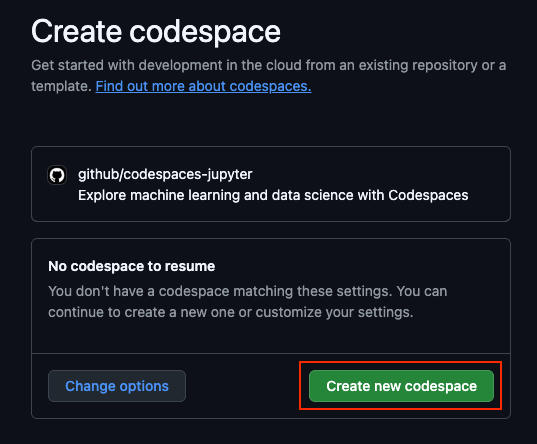
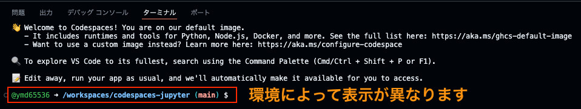
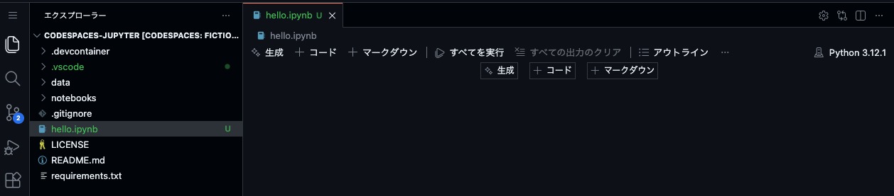
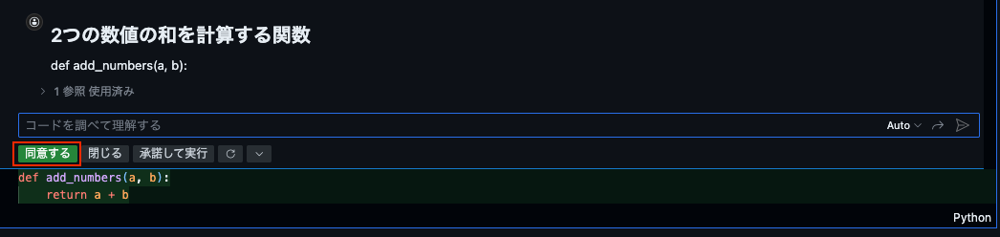

## この記事のポイント

## はじめに

この記事では「この前リリースされた機能って実際に動かすとどんな感じなんだろう」とか
「もしかしたら内容次第では使えるかも？？」とか「結構前からあるけど、実際どうなんだろう」など
GitHubの中でも特定の機能にフォーカスして検証していく記事です。

今回は[機械学習のための GitHub Codespacesの概要](https://docs.github.com/ja/codespaces/developing-in-a-codespace/getting-started-with-github-codespaces-for-machine-learning)というドキュメントページがあったので

Codespaces上でJupyter環境を構築してみたり、他にJupyter環境を構築する方法がないかを調査してみます。

## 全人類が生成AIを触っているので機械学習にもフォーカスがあたっているようなそんな頃合い

生成AIが注目されている昨今、基礎技術あるいは抱合関係にある機械学習に対しての関心が高まっているかなと感じています。
でも、いざ機械学習を始めようと思っても、環境構築が難しかったり、そもそも何から始めれば良いのか分からなかったりすることも多いです。

とはいえ、手段はたくさん提供されていてたとえば、クラウドエンジニアであれば、クラウドサービスを使って機械学習環境を構築することができます。
具体的には以下のようなサービスがあります。

- Google Cloud
  - Vertex AIとBigQuery MLを使う
- AWS
  - SageMaker Studio Labを使ってJupyter環境を構築する
- Azure
  - Azure Machine Learning Studioを使う

※要件や予算に応じて、他の機能、他のクラウドサービスを使うことも可能です。Databricksや、Google Colabなどもあります。

とはいえ、これらのクラウドサービスを使うにはアカウント登録が必要である点やクラウドサービスの利用に慣れていないと、最初の一歩を踏み出すのが難しいこともあります。
※ひょっとすると、Google Colabの方が手軽かもしれませんが、誰がどんな用途で使うかによっても変わると思います。

とりあえず、機械学習環境としてJupyter環境を手軽に構築できる方法があれば、試してみたいと思う人も多いのではないでしょうか。

## 復習：Jupyter環境あるいはJupyter Notebookとは

何回か、Jupyter NotebookやJupyter環境について説明してきましたが、改めて簡単に説明します。

Jupyter Notebookは、データサイエンスや機械学習の分野で広く使われているオープンソースのウェブアプリケーションです。
Jupyter Notebookを使うとセル単位でコードの作成、実行、共有が簡単に行えます。

[参考：Project Jupyter - Home](https://jupyter.org/)

多くのJupyter環境ではこのJupyter Notebookが利用されており、インターフェイスも継承されています。
ですのでたとえば、Google Colabで作ったJupyter Notebookは、他のJupyter環境（Vertex AI Workbench、Sagemaker、AzureMLなど）でも問題なく動作します。
※各クラウドが独自で提供するサービスを使う場合は、多少の差異があるかもしれません。

なお、今回紹介するJupyterですが、JupyterLab以外にもJupyterHubといったマルチアカウント対応のJupyter環境もあります。
興味のある方は調べてみてください。

## GitHub CodespacesでJupyter環境を構築する場合

GitHub Codespacesは、クラウド上で開発環境を提供するサービスですが、Jupyter環境も構築できます。
具体的には以下の2つの方法があります。

- Jupyter templateを使う
  - https://github.com/github/codespaces-jupyter
- devcontainer.jsonを使って自分で環境を構築する

2つ目の方法はすでに他の環境でJupyterを構築したことがあるいわゆる上級者向けなので、今回は1つ目の方法を紹介します。

### Jupyter templateを使う場合

どのようにしてJupyter環境を構築するかですが、GitHub CodespacesにはJupyter用のテンプレートが用意されており
以下のURLからJupyter Notebookを選択することで簡単に構築できます。

[Codespace templates](https://github.com/codespaces/templates)

あるいはcodespaces-jupyterリポジトリのトップページから`Use this template`ボタンをクリックすることでも同様にJupyter環境を構築できます。

### え？もっと簡単にJupyter環境を構築したいって？

もっと簡単にJupyter環境を構築したい場合は、以下のリンクをクリックするだけでCodespaces上にJupyter環境が構築されます。（凄まじい便利さ）

[](https://codespaces.new/github/codespaces-jupyter)

上記のリンクの作り方については以下のドキュメントを参照してください。

[参考:codespace の迅速な作成と再開を容易にする - GitHub ドキュメント](https://docs.github.com/ja/codespaces/setting-up-your-project-for-codespaces/setting-up-your-repository/facilitating-quick-creation-and-resumption-of-codespaces#github-codespaces-%E3%81%A7%E9%96%8B%E3%81%8F-%E3%83%90%E3%83%83%E3%82%B8%E3%81%AE%E4%BD%9C%E6%88%90)

ちょっとDeepな話をすると上記の機能は開発コンテナと深い関係がありますが、割愛します。
今回はCodespacesはDev Containerの設定を参照しているとだけ覚えておいてください。

## セットアップ

では、凄まじい便利さを体験してみましょう。まずは以下のリンクをクリックしてください。

[](https://codespaces.new/github/codespaces-jupyter)

クリックするとCreate codespaceの画面が表示されるので、`Create new codespace`をクリックします。



なお、ここで左側にある`change options`をクリックすると、Codespacesのスペック（ブランチ、Dev ContainerのConfig、リージョンやCPU）を変更できます。

## Jupyter環境の確認

起動するまで時間がかかりますので、しばらく待ちます。以下のようにターミナルが起動するまで待ちます。
※ターミナルに表示される文字列は環境によって異なります。



## ハンズオン

今回のおおまかな流れは以下の通りです。

1. 準備体操：PythonとJupyterのバージョン確認、Hello Worldの実行
2. Jupyter Notebookを起動してみる
3. GitHub Copilotを使ってみる

### 準備体操

まずはPythonのバージョンとインストール先を確認してみましょう。ターミナルで以下のコマンドを実行します。

```bash
python --version && which python
# Python 3.12.1
# /home/codespace/.python/current/bin/python
```

とりあえず、Hello Worldを実行します。

```bash
python -c "print('Hello, World')"
```

Jupyterのバージョンを確認します。

```bash
jupyter --version
```

実行結果は以下の通りです。

```text
Selected Jupyter core packages...
IPython          : 9.2.0
ipykernel        : 6.29.5
ipywidgets       : 8.1.2
jupyter_client   : 8.6.3
jupyter_core     : 5.7.2
jupyter_server   : 2.15.0
jupyterlab       : 4.4.2
nbclient         : 0.10.2
nbconvert        : 7.16.6
nbformat         : 5.10.4
notebook         : not installed
qtconsole        : not installed
traitlets        : 5.14.3
```

### Jupyter Notebookを起動してみる

ターミナル上でもJupyter Notebookを起動できますが、CodespacesにはJupyter Notebookを起動するためのGUIが用意されています。厳密にはipynbファイルを開くとnotebookのインターフェイスが起動します。

新規ファイルの作成で`New File`をクリックし、ファイル名を`hello.ipynb`として保存します。

`hello.ipynb`を開くと次のとおり、Jupyter Notebookのインターフェイスが起動します。



Jupyter Notebookはセルという単位でコードを実行できます。同じノートブックの範囲内であれば、変数や関数を共有できます。
`+コード`をクリックしてコードセルを追加し、以下のコードを入力して実行してみましょう。

```python
greeting = "Hello, Jupyter on Codespaces!"
print(greeting)
```

実行結果は以下の通りです。セルの下に結果が表示されます。

```text
Hello, Jupyter on Codespaces!
```

### GitHub Copilotを使ってみる

`生成`というボタンが表示されている場合はGitHub Copilotを使ってコードを生成できます。試しに以下のように指示を入力して実行みてください。

```python
# 2つの数値の和を計算する関数
def add_numbers(a, b):
```

実行すると以下のようにコードが生成されます。同意します。



次に、以下のコードを追加して実行してみましょう。

```python
f" 5 + 7 = {add_numbers(5, 7)}"
# f文字列を使って結果を表示
```

あるいは、以下のようにコードを実行しても同じ結果が得られます。

```python
result = add_numbers(5, 7)
print("5 + 7 =", result)
```

実行結果は以下の通りです。

```text
' 5 + 7 = 12'
```

### オプション：notebooksのディレクトリにあるサンプルを確認する

今回のハンズオンで作成したCodespacesには`notebooks`ディレクトリがあり、いくつかのサンプルノートブックが用意されています。興味のある方は確認してみてください。

### おまけ：vscode-data-wrangler 

今回はJupyter環境を使って簡単なコードを実行しました。もっと簡単にデータ分析を実行したい場合は、[vscode-data-wrangler](https://github.com/microsoft/vscode-data-wrangler)という拡張機能を使う方法もあります。

vscode-data-wranglerは、VSCode上でデータの前処理や可視化を簡単に行うための拡張機能です。GUIベースで操作できるため、コードを書かずにデータ分析を行いたい場合に便利です。もちろん、GitHub Codespaces上でも利用できます。

## 思うところ

実際に触ってみましたが、非常に簡単にJupyter環境を構築できました。
とはいえ、日頃からデータ分析や機械学習を行っている人にとっては、既存のクラウドサービスを使う方が良い場合もあるかもしれません。

というのも多くの企業ではデータがよく使うクラウド上にあって、そして、Vertex AIやSagemakerといったクラウドサービスを使っているはずです。

そうするとCodespacesでJupyterを使うということはどういうことかというと
基本的にはソースコードはGitHubにあり、ソースコードが利用するデータはクラウド上にあるということになるかなと思います。

データはクラウド、ソースはGitHubという状態が良いか悪いかというところはMLでいうところの実験管理の側面もあるので、なんとも難しいところです。また、MLパイプラインがどうなっているかどこにあるかによっても変わると思います。

長々と書きましたが、要は使い分けが重要かなというところですが、デバッグやちょっとした試験的な実験を行うにはCodespaces上のJupyter環境は非常に便利だと思います。

## まとめ

GitHub Codespaces上でJupyter環境を構築してみましたが、最小構成で使う場合においては非常に簡単で便利でした。
ただし、実際に機械学習を行う場合は、データの所在やMLパイプラインの構成によっては他のクラウドサービスを使う方が良い場合もあると思います。

データの所在を気にされる場合やMLパイプラインの構成を気にされる場合は、他のクラウドサービスを使うことを検討してしまいそうですが、そうでない場合、ちょっとした試験的な実験やデバッグを行う場合にはCodespaces上のJupyter環境は非常に便利です。

## 余談：Jupyter環境を構築する方法（いくつか紹介）

今回紹介する方法以外でもJupyter環境を構築する方法はたくさんあります。

- ローカルPCにAnaconda/Conda/miniConda/PythonをインストールしてJupyter環境を構築する
  - Dockerを使ってJupyter環境を構築する
- 主要なクラウドサービスを使ってJupyter環境を構築する
  - Google CloudのVertex AI Workbenchを使う
  - Amazon SageMakerを使う
  - Azure Machine Learningを使う
- SaaSを使う
  - Databricksを使う
- Google Colabを使う
